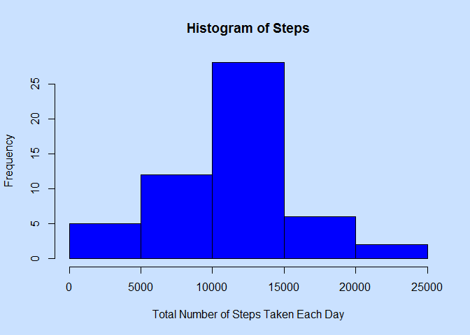
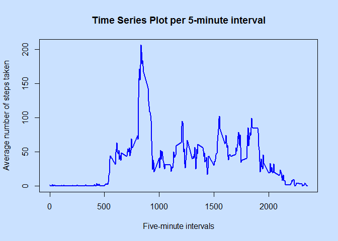
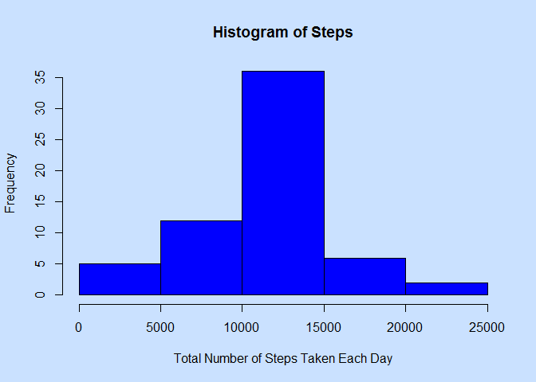
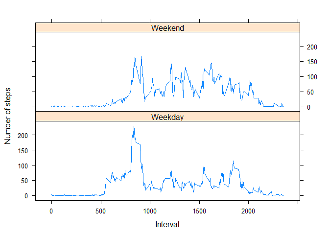

# Reproducible Research: Peer Assessment 1
Ola Lie  
September 11, 2015  

## Loading and preprocessing the data
Show any code that is needed to

1. Load the data (i.e. read.csv())


```r
    ## Remember to set your working directory
    setwd("C:\\Users\\olalie\\Documents\\DataScience\\5_Reproducible_Research\\COUSE_PROJECTS\\RepData_PeerAssessment1")
    
    unzip("activity.zip")        
    df <- read.csv("activity.csv")   # Load data
```
2. Process/transform the data (if necessary) into a format suitable for your analysis


```r
    df$date <- as.Date(df$date, format = "%Y-%m-%d")  # convert 'date' from factor to date
```

## What is mean total number of steps taken per day?
1. For this part of the assignment, you can ignore the missing values in the dataset.

2. Make a histogram of the total number of steps taken each day


```r
    df.days <- aggregate(df$steps, by=list(df$date), FUN=sum)
    colnames(df.days) <- c("day","steps")
    par(bg = "lightsteelblue1")
    hist(df.days$steps,
        main="Histogram of Steps",
        xlab="Total Number of Steps Taken Each Day",
        col="blue")
```

 

3. Calculate and report the mean and median total number of steps taken per day


```r
    meanSteps <- as.integer(round(mean(df.days$steps, na.rm = TRUE)))
    meanSteps
```

```
## [1] 10766
```

```r
    medianSteps <- as.integer(round(median(df.days$steps, na.rm = TRUE)))
    medianSteps
```

```
## [1] 10765
```

The mean total number of steps taken per day is 10766.

The median total number of steps taken per day is 10765.

## What is the average daily activity pattern?

Make a time series plot (i.e. type = "l") of the 5-minute interval (x-axis) and the average number of steps taken, averaged across all days (y-axis)


```r
    library(dplyr)
```

```
## 
## Attaching package: 'dplyr'
## 
## The following object is masked from 'package:stats':
## 
##     filter
## 
## The following objects are masked from 'package:base':
## 
##     intersect, setdiff, setequal, union
```

```r
    df.interval <- df[complete.cases(df),] %>% group_by(interval) %>% summarise(steps = mean(steps))
    par(bg = "lightsteelblue1")
    plot(df.interval,
         type='l',
         lwd = 2,
         main = 'Time Series Plot per 5-minute interval',
         xlab = 'Five-minute intervals',
         ylab = 'Average number of steps taken',
         col='blue')
```

 

Which 5-minute interval, on average across all the days in the dataset, contains the maximum number of steps?


```r
    maxInterval <- df.interval[which.max(df.interval$steps),1]
    maxInterval
```

```
## Source: local data frame [1 x 1]
## 
##   interval
## 1      835
```

The 5-minute inteval which contains the maximum number of steps is at 835.

## Imputing missing values
Note that there are a number of days/intervals where there are missing values (coded as NA). The presence of missing days may introduce bias into some calculations or summaries of the data.

1. Calculate and report the total number of missing values in the dataset (i.e. the total number of rows with NAs)


```r
numberOfRowsWithNAS <- sum(!complete.cases(df))

numberOfRowsWithNAS
```

```
## [1] 2304
```

The total number of missing values in the dataset is 2304.

2. Devise a strategy for filling in all of the missing values in the dataset. The strategy does not need to be sophisticated. For example, you could use the mean/median for that day, or the mean for that 5-minute interval, etc.

*I choose to impute missing values with the mean for that 5-minute interval.*

3. Create a new dataset that is equal to the original dataset but with the missing data filled in.


```r
    ## When I encounter a NA, I get the 5-minute interval, and do a lookup in the
    ## dataframe which stores the averages for the 5-minute intervals
    
    for (i in 1:nrow(df)) {
        if(is.na(df$steps[i])) {
            df$steps[i] <- as.integer(round(df.interval[df.interval$interval==df[i,c("interval")],c("steps")]))
        }
    }
```

4. Make a histogram of the total number of steps taken each day and Calculate and report the mean and median total number of steps taken per day. Do these values differ from the estimates from the first part of the assignment? What is the impact of imputing missing data on the estimates of the total daily number of steps?


```r
    df.days <- aggregate(df$steps, by=list(df$date), FUN=sum)
    colnames(df.days) <- c("day","steps")
    par(bg = "lightsteelblue1")
    hist(df.days$steps,
        main="Histogram of Steps",
        xlab="Total Number of Steps Taken Each Day",
        col="blue")
```

 

```r
    meanSteps <- as.integer(round(mean(df.days$steps, na.rm = TRUE)))
    meanSteps
```

```
## [1] 10766
```

```r
    medianSteps <- as.integer(round(median(df.days$steps, na.rm = TRUE)))
    medianSteps
```

```
## [1] 10762
```

The mean total number of steps taken per day is 10766.

The median total number of steps taken per day is 10762.

The mean is the same.

The median is almost the same.

The histogram has a similar shape and higher frequencies

## Are there differences in activity patterns between weekdays and weekends?

For this part the weekdays() function may be of some help here. Use the dataset with the filled-in missing values for this part.

1. Create a new factor variable in the dataset with two levels - "weekday" and "weekend" indicating whether a given date is a weekday or weekend day.


```r
    Sys.setlocale("LC_TIME", "English") #use English date names
```

```
## [1] "English_United States.1252"
```

```r
    df$date<- as.Date(df$date)

    for (i in 1:nrow(df)) {
        
        if(weekdays(df$date[i])=="Saturday" || weekdays(df$date[i])=="Sunday") {
            df$day[i] <- "Weekend"
        }
        else {
            df$day[i] <- "Weekday"
        }
    }
    
    df$day<- as.factor(df$day)
```

2. Make a panel plot containing a time series plot (i.e. type = "l") of the 5-minute interval (x-axis) and the average number of steps taken, averaged across all weekday days or weekend days (y-axis). See the README file in the GitHub repository to see an example of what this plot should look like using simulated data.


```r
    df.interval <- df %>% group_by(day,interval) %>% summarise(steps = mean(steps))
    library(lattice)
    with(df.interval, xyplot(steps~interval|day,
        type='l',
        layout=c(1,2),
        xlab = "Interval", 
        ylab = "Number of steps"))
```

 
